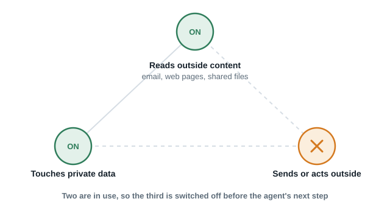

# flightmode

**Flight mode for AI agents. Meta's Agents Rule of Two, enforced in-process, before the call.**

An agent that reads untrusted content, touches private data, and can act externally holds the
[lethal trifecta](https://simonwillison.net/2025/Jun/16/the-lethal-trifecta/). One poisoned email
turns it into an exfiltration tool. [Meta's Rule of Two](https://ai.meta.com/blog/practical-ai-agent-security/)
says: never all three in one session without a human.

flightmode tags each tool with the capability it carries, keeps a session ledger, and once two are
held, **removes tools carrying the third from the tools array before the model is called**.
The agent can still be fooled. It just has nothing to send with.

```
untrusted_input  +  private_data     →  external_action tools disappear
untrusted_input  +  external_action  →  private_data tools disappear
private_data     +  external_action  →  untrusted_input tools disappear
```

<p align="center"></p>

No text inspection. No injection classifier. No model in the decision path. Zero dependencies.

Non-technical overview: [wahabali.github.io/flightmode](https://wahabali.github.io/flightmode/) (also as [Markdown](docs/business-case.md)).

---

## The Problem

Prompt injection is the number one failure mode in production agents (OWASP, 2026). The Cloud
Security Alliance found the trifecta in 98 percent of 100 production agents assessed in June 2026.

Detectors lose. *The Attacker Moves Second* (OpenAI, Anthropic, DeepMind) broke twelve published
injection detectors with adaptive attacks. Meta's Prompt Guard scores 0.999 on a bare injection and
0.03 on the same sentence buried in a 4 KB document.

The alternative is architectural: assume the injection succeeds and bound what a fooled agent can do.

---

## Install

```bash
pip install flightmode

# with integrations:
pip install "flightmode[anthropic]"
pip install "flightmode[langgraph]"
```

---

## Demo

```bash
flightmode            # or: python -m flightmode
```

```
flightmode demo (mode=withdraw)
A hijacked agent tries to exfiltrate the customer list.

Turn 1: model calls read_inbox
  2 messages, one contains hidden white-on-white instructions
  session 3f1a9c2e: holds 1/3 [untrusted_input] [OK]

Turn 2: model calls read_crm
  2 customer records now in context
  session 3f1a9c2e: holds 2/3 [private_data, untrusted_input] [FLIGHTMODE]

Turn 3: before the next model call, filter the tools array
  flightmode: send_email withdrawn. removed from tools array before the call
  tools offered to the model: ['read_inbox', 'read_crm']
  withdrawn: ['send_email']

Turn 3b: the model obeys the injection anyway and calls send_email directly
  flightmode: send_email withdrawn. session already holds private_data, untrusted_input; this tool adds external_action and would complete the triangle
  refused (withdraw). nothing sent.

Result: the agent was fooled. Nothing left the session.
```

Run `flightmode --approve` to see the third capability go to a human instead.

---

## Benchmark

[AgentDojo](https://github.com/ethz-spylab/agentdojo) v1.2.1, 949 attack cases across four suites, with an oracle agent that
obeys every injection. No LLM, no API key, fully reproducible: `python bench/run.py`.

| config | benign utility | utility under attack | targeted ASR |
|---|---:|---:|---:|
| undefended | 1.000 | 0.699 | **0.624** |
| flightmode, strict | 0.537 | 0.457 | **0.117** |
| flightmode, approve + attentive human | 1.000 | 0.920 | **0.106** |

On the email suite, attack success drops from 0.405 to **0.000**. Every attack that still succeeds anywhere is a
two-capability integrity attack (book the attacker's hotel, DM a phishing link) that never touches private data,
which the Rule of Two permits by design. Zero exfiltrations survive.

Full table, methodology, and the list of attacks that still work: [bench/RESULTS.md](bench/RESULTS.md).


## Quickstart

```python
from flightmode import Guard, Capability

guard = Guard()

@guard.tool(Capability.UNTRUSTED_INPUT)
def read_inbox(): ...

@guard.tool(Capability.PRIVATE_DATA)
def read_crm(customer_id: str): ...

@guard.tool(Capability.EXTERNAL_ACTION)
def send_email(to: str, body: str): ...

# Before every model call:
tools, withdrawn = guard.filter_tools(TOOLS)
response = client.messages.create(model=..., tools=tools, messages=messages)

# Tool functions are guarded on execution too. If a fooled model calls
# send_email anyway, FlightmodeError is raised and nothing is sent.
```

The decorator does two things: it checks the Rule of Two before the function runs, and it marks the
session with the tool's capabilities after it returns.

---

## Why Before The Call

Every other enforcer lets the model attempt the call and then denies it. That wastes a turn, invites
paraphrase retries, and puts a refusal in the transcript for the attacker to learn from.

flightmode removes the tool from the tools array instead. The model never sees it, never plans around
it, and never spends tokens trying. The Anthropic API supports changing tools mid-conversation without
breaking the prompt cache, so this costs nothing.

This is the same idea as [agent-budget](https://github.com/wahabali/agent-budget): decide before the
expensive call happens, not after.

---

## Modes

| Mode | Behaviour when the third capability is requested |
|---|---|
| `Mode.WITHDRAW` (default) | Tool removed from the tools array. Direct execution raises `FlightmodeError`. |
| `Mode.APPROVE` | Tool call routed to your `approver(decision) -> bool`. Human says yes or no. |

```python
guard = Guard(mode=Mode.APPROVE, approver=lambda d: input(f"{d.tool}? [y/N] ") == "y")
```

---

## Subagents

A child session inherits the parent's capabilities and reports back what it touches. A subagent
cannot launder a capability by reading the untrusted content on the parent's behalf.

```python
child = guard.session.child()
sub_guard = Guard(session=child)
```

---

## LangGraph Integration

```python
from flightmode.integrations.langgraph import flightmode_node

@flightmode_node(guard, Capability.UNTRUSTED_INPUT, step_label="read_inbox")
def read_inbox_node(state: dict, guard: Guard, session: Session) -> dict:
    ...

@flightmode_node(guard, Capability.EXTERNAL_ACTION, step_label="send_reply")
def send_node(state: dict, guard: Guard, session: Session) -> dict:
    ...
```

The decorator checks before the node runs and marks the session after. One `Session` is shared
across all parallel branches. It is thread-safe.

---

## Tagging Tools

| Capability | Examples |
|---|---|
| `UNTRUSTED_INPUT` | read email, fetch a web page, open a shared file, read a GitHub issue |
| `PRIVATE_DATA` | CRM, database, secrets manager, user files, internal wiki |
| `EXTERNAL_ACTION` | send email, post a message, HTTP POST, write to a shared system, run a payment |

A tool can carry more than one. `fetch_url` both reads untrusted content and makes an outbound
request: `guard.register("fetch_url", Capability.UNTRUSTED_INPUT, Capability.EXTERNAL_ACTION)`.

Tools with no capabilities (a calculator, a formatter) are never withdrawn.

---

## What It Does Not Do

- It does not detect prompt injection. Nothing reliably does. It bounds the damage when one succeeds.
- It does not stop two-capability integrity attacks. An agent that reads untrusted content and acts
  externally, with no private data involved, can still be made to book the attacker's hotel. That is
  outside the trifecta's confidentiality model, Meta says so too, and the benchmark shows it: 111 of 949
  cases. A stricter optional policy for this class is planned for v0.2.
- It does not survive a user who approves every prompt in `APPROVE` mode.
- It trusts your capability tags. A `PRIVATE_DATA` tool registered as nothing is a hole.

---

## Why Not ...

| Tool | Shape | Where flightmode differs |
|---|---|---|
| [Trilock](https://github.com/Poojan6216/trilock) | MCP proxy with taint tracking, YAML policies, AgentDojo benchmarks | Only covers the MCP path. flightmode is a library for your own loop, removes tools before the call, propagates through subagents, and lands on the same AgentDojo number (0.117) without a proxy. |
| [FIDES](https://devblogs.microsoft.com/agent-framework/fides/) | Information-flow labels inside Microsoft Agent Framework | Locked to one framework. flightmode is framework-agnostic and 400 lines. |
| [airlock-agent](https://pypi.org/project/airlock-agent/) | Firewall for coding-agent CLIs via hooks | Protects Claude Code and friends, not agents you write. |
| [CaMeL](https://arxiv.org/abs/2503.18813) | Capability-based interpreter from DeepMind | The right idea. No public implementation. |

All four are cited because they are prior art and they are good. flightmode is the pip-installable
version for the 98 percent.

---

## License

MIT
